# sdsde Library


This library SDSDE (Simplify Data Science and Data Engineering) is a library that focuses on making Data Science and Data Engineering tasks much easier for the masses this is a pre-release so this isn't, but will be a pypi library, but I plan on spending time improving this and releasing this as a tool that will help organizations that are Snowflake, Azure and Gitlab focused.

This template approach can easily be transfered to other clouds, but would need time and focus to make sure this was possible. Hope this is something someone finds and is happy take code from this that makes their lives much easier in the future.

Inside of this library you will have all the tools needed to move data from azure datalakes and snowflake to help build Full Data Science Pipelines.

I am planning on releasing a template example of this with a kaggle example similar to below expect I will focus on treating the Kaggle API as the ingestion point to azure datalake and then move that data to snowflake to be queried from a feature store and then modeled and create model inference against the test set.

What you will learn from that template is that one can iterate quickly and get a full Data Science Pipeline out the door in less than a day. This way business uses


# Kaggle Examples

```python
import logging
import pandas as pd
import numpy as np
import xgboost as xgb

from sdsde.modeling.preprocessingfastai import generate_fastai_pytorch_dataloader
from sdsde.modeling.trainingfastai import train_fastai_tabular_model
from sdsde.utils.traininghelpers import  binary_classification_reporter_sklearn
from sdsde.utils.traininghelpersfastai import binary_classification_reporter_fastai_dl, change_dl_to_pandas_df
from sdsde.modeling.training import HpOptBinary
from fastai.tabular.core import CategoryBlock, Categorify, FillMissing, Normalize
from fastai.basics import *
from fastai.tabular.all import *
from hyperopt import hp


logging.basicConfig(level=logging.INFO)
logging.getLogger("azure.core").setLevel(logging.WARNING)
logging.getLogger("urllib3.connectionpool").setLevel(logging.CRITICAL)
logging.getLogger("snowflake.connector").setLevel(logging.WARNING)
logger = logging.getLogger(__name__)
```

This approach will not win you a Kaggle Competition, but it will get you a baseline and allow you to iterate quickly and get quick feed back from Kaggle to know if what you are doinng is making a difference.

## Binary Classification Classic Titanic

```python
! kaggle competitions list -s titanic
```

    ref      deadline             category            reward  teamCount  userHasEntered  
    -------  -------------------  ---------------  ---------  ---------  --------------  
    titanic  2030-01-01 00:00:00  Getting Started  Knowledge      13982            True  


```python
! kaggle competitions submissions  -c titanic
```

    fileName          date                 description    status    publicScore  privateScore  
    ----------------  -------------------  -------------  --------  -----------  ------------  
    titantic_sub.csv  2022-02-03 19:31:30  Quick Xgboost  complete  0.73444      None          
    titantic_sub.csv  2022-02-03 19:27:28  Auto Fastai    complete  0.74401      None          


```python
!kaggle competitions download -c titanic

! unzip titanic.zip
```

    Downloading titanic.zip to /home/azureuser/gitlab/sdsde/nbs
      0%|                                               | 0.00/34.1k [00:00<?, ?B/s]
    100%|██████████████████████████████████████| 34.1k/34.1k [00:00<00:00, 8.58MB/s]
    Archive:  titanic.zip
      inflating: gender_submission.csv   
      inflating: test.csv                
      inflating: train.csv               


### DL Method Tabluar

```python

df = pd.read_csv('train.csv')

logger.info(f'Size of data set: {df.shape}')

# quick feature eng
def feature_create(df):
    df['Fare_Bucket'] = pd.qcut(df['Fare'], 13)
    df['Age'] = pd.qcut(df['Age'], 10)
    df['Ticket_Frequency'] = df.groupby('Ticket')['Ticket'].transform('count')
    df['Title'] = df['Name'].str.split(', ', expand=True)[1].str.split('.', expand=True)[0]
    df['Is_Married'] = 0
    df['Is_Married'] = np.where(df.Title == 'Mrs', 1, 0)
    return df
df = feature_create(df)
df.loc[df.sample(frac=0.05).index, 'Fare'] = np.nan
display(df.head(3))
```

    INFO:__main__:Size of data set: (891, 12)


<div>
<style scoped>
    .dataframe tbody tr th:only-of-type {
        vertical-align: middle;
    }

    .dataframe tbody tr th {
        vertical-align: top;
    }

    .dataframe thead th {
        text-align: right;
    }
</style>
<table border="1" class="dataframe">
  <thead>
    <tr style="text-align: right;">
      <th></th>
      <th>PassengerId</th>
      <th>Survived</th>
      <th>Pclass</th>
      <th>Name</th>
      <th>Sex</th>
      <th>Age</th>
      <th>SibSp</th>
      <th>Parch</th>
      <th>Ticket</th>
      <th>Fare</th>
      <th>Cabin</th>
      <th>Embarked</th>
      <th>Fare_Bucket</th>
      <th>Ticket_Frequency</th>
      <th>Title</th>
      <th>Is_Married</th>
    </tr>
  </thead>
  <tbody>
    <tr>
      <th>0</th>
      <td>1</td>
      <td>0</td>
      <td>3</td>
      <td>Braund, Mr. Owen Harris</td>
      <td>male</td>
      <td>(19.0, 22.0]</td>
      <td>1</td>
      <td>0</td>
      <td>A/5 21171</td>
      <td>7.2500</td>
      <td>NaN</td>
      <td>S</td>
      <td>(7.229, 7.75]</td>
      <td>1</td>
      <td>Mr</td>
      <td>0</td>
    </tr>
    <tr>
      <th>1</th>
      <td>2</td>
      <td>1</td>
      <td>1</td>
      <td>Cumings, Mrs. John Bradley (Florence Briggs Thayer)</td>
      <td>female</td>
      <td>(36.0, 41.0]</td>
      <td>1</td>
      <td>0</td>
      <td>PC 17599</td>
      <td>71.2833</td>
      <td>C85</td>
      <td>C</td>
      <td>(55.9, 83.158]</td>
      <td>1</td>
      <td>Mrs</td>
      <td>1</td>
    </tr>
    <tr>
      <th>2</th>
      <td>3</td>
      <td>1</td>
      <td>3</td>
      <td>Heikkinen, Miss. Laina</td>
      <td>female</td>
      <td>(25.0, 28.0]</td>
      <td>0</td>
      <td>0</td>
      <td>STON/O2. 3101282</td>
      <td>7.9250</td>
      <td>NaN</td>
      <td>S</td>
      <td>(7.896, 8.05]</td>
      <td>1</td>
      <td>Miss</td>
      <td>0</td>
    </tr>
  </tbody>
</table>
</div>


```python

cat_vars = ['Pclass', 'Name', 'Sex', 'Age', 'SibSp', 'Parch',
            'Ticket', 'Cabin', 'Embarked', 'Fare_Bucket',
            'Ticket_Frequency', 'Title', 'Is_Married']
cont_vars = ['Fare']
y_var = ['Survived']

dl_train, tab_train = generate_fastai_pytorch_dataloader(df, cat_vars=cat_vars, cont_vars=cont_vars, 
                                                         y_var=y_var, y_block=CategoryBlock(), y_range=None,
                                                         val_pct=0.2, bs=25, procs = [Categorify, FillMissing, Normalize],
                                                         seed=123, splits=None)

learn, probs, y, loss = train_fastai_tabular_model(dl = dl_train, 
                                                   layer_sizes = [50, 10],
                                                   metrics = [Recall(), accuracy, F1Score(), RocAucBinary(), BalancedAccuracy()],
                                                   epochs = 5,
                                                   wd=0.2,
                                                   model_name = 'sdsde_test_dl_model_fast.pkl',
                                                   save_metric_monitor = 'balanced_accuracy_score',
                                                   save_comp = np.greater,
                                                   early_metric_monitor = 'balanced_accuracy_score',
                                                   early_comp = np.greater,
                                                   early_min_delta = 1e-5,
                                                   patience = 5,
                                                   project_location='projects/model-runs/latest/classification/models/dl/',
                                                   y_range = None, # for regression
                                                   plot=True)


binary_classification_reporter_fastai_dl(probs, y=y, threshold=0.5, plot=True, bins=5)
```

    INFO:sdsde.modeling.preprocessingfastai:Training Data Size 713
    INFO:sdsde.modeling.preprocessingfastai:Validation Data Size 178
    INFO:sdsde.modeling.preprocessingfastai:Categorical Variable(s) For Project ['Pclass', 'Name', 'Sex', 'Age', 'SibSp', 'Parch', 'Ticket', 'Cabin', 'Embarked', 'Fare_Bucket', 'Ticket_Frequency', 'Title', 'Is_Married']
    INFO:sdsde.modeling.preprocessingfastai:Continuous Variable(s) For Project ['Fare']
    INFO:sdsde.modeling.preprocessingfastai:Dependent Variable(s) For Project ['Survived']
    INFO:sdsde.modeling.preprocessingfastai:dataloader being created
    INFO:sdsde.modeling.preprocessingfastai:   Pclass  Name  Sex  Age  SibSp  Parch  Ticket  Cabin  Embarked  Fare_Bucket  \
    0       3   109    2    3      2      1     524      0         3            2   
    3       1   273    1    7      2      1      50     56         3           11   
    4       3    16    2    7      1      1     473      0         3            4   
    8       3   413    1    5      1      3     345      0         3            6   
    9       2   577    1    1      2      1     133      0         1           10   
    
       Ticket_Frequency  Title  Is_Married  Fare_na      Fare  
    0                 1     12           1        1 -0.477924  
    3                 2     13           2        1  0.422923  
    4                 1     12           1        1 -0.462206  
    8                 3     13           2        1 -0.401626  
    9                 2     13           2        1 -0.029548  


    /home/azureuser/miniconda3/envs/dsde_upgrade/lib/python3.8/site-packages/fastai/callback/schedule.py:270: UserWarning: color is redundantly defined by the 'color' keyword argument and the fmt string "ro" (-> color='r'). The keyword argument will take precedence.
      ax.plot(val, idx, 'ro', label=nm, c=color)
    INFO:sdsde.modeling.trainingfastai:Learning Rate Suggestion SuggestedLRs(valley=0.001737800776027143)


<table border="1" class="dataframe">
  <thead>
    <tr style="text-align: left;">
      <th>epoch</th>
      <th>train_loss</th>
      <th>valid_loss</th>
      <th>recall_score</th>
      <th>accuracy</th>
      <th>f1_score</th>
      <th>roc_auc_score</th>
      <th>balanced_accuracy_score</th>
      <th>time</th>
    </tr>
  </thead>
  <tbody>
    <tr>
      <td>0</td>
      <td>0.628193</td>
      <td>0.661324</td>
      <td>0.000000</td>
      <td>0.601124</td>
      <td>0.000000</td>
      <td>0.748848</td>
      <td>0.500000</td>
      <td>00:00</td>
    </tr>
    <tr>
      <td>1</td>
      <td>0.477936</td>
      <td>0.611730</td>
      <td>0.014085</td>
      <td>0.606742</td>
      <td>0.027778</td>
      <td>0.874292</td>
      <td>0.507042</td>
      <td>00:00</td>
    </tr>
    <tr>
      <td>2</td>
      <td>0.329095</td>
      <td>0.468887</td>
      <td>0.591549</td>
      <td>0.797753</td>
      <td>0.700000</td>
      <td>0.873239</td>
      <td>0.763064</td>
      <td>00:00</td>
    </tr>
    <tr>
      <td>3</td>
      <td>0.216401</td>
      <td>0.449692</td>
      <td>0.732394</td>
      <td>0.780899</td>
      <td>0.727273</td>
      <td>0.869817</td>
      <td>0.772739</td>
      <td>00:00</td>
    </tr>
    <tr>
      <td>4</td>
      <td>0.152425</td>
      <td>0.447413</td>
      <td>0.718310</td>
      <td>0.786517</td>
      <td>0.728571</td>
      <td>0.869817</td>
      <td>0.775043</td>
      <td>00:00</td>
    </tr>
  </tbody>
</table>


    Better model found at epoch 0 with balanced_accuracy_score value: 0.5.


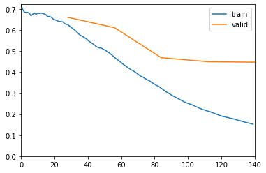


    Better model found at epoch 1 with balanced_accuracy_score value: 0.5070422535211268.
    Better model found at epoch 2 with balanced_accuracy_score value: 0.7630643675134922.
    Better model found at epoch 3 with balanced_accuracy_score value: 0.7727392391733579.
    Better model found at epoch 4 with balanced_accuracy_score value: 0.7750427800447546.


    INFO:root:Percent Predicted Set 0.388%
    INFO:root:Percent Predicted Set at 0.5 threshold 0.388%


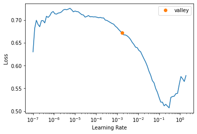


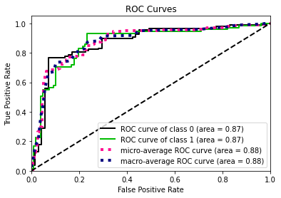


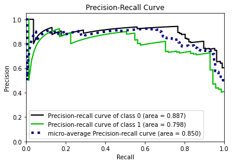


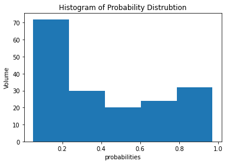


    INFO:root:Percent Return Actual Set 0.399%
    INFO:root:Accuracy For Each Class
    INFO:root:[0.8317757  0.71830986]
    INFO:root:[[89 18]
     [20 51]]
    INFO:root:              precision    recall  f1-score   support
    
               0       0.82      0.83      0.82       107
               1       0.74      0.72      0.73        71
    
        accuracy                           0.79       178
       macro avg       0.78      0.78      0.78       178
    weighted avg       0.79      0.79      0.79       178
    
    INFO:root:Accuracy For Each Class 0.4 Cut Off for Model
    INFO:root:[0.8317757  0.71830986]
    INFO:root:[[89 18]
     [20 51]]
    INFO:root:              precision    recall  f1-score   support
    
               0       0.82      0.83      0.82       107
               1       0.74      0.72      0.73        71
    
        accuracy                           0.79       178
       macro avg       0.78      0.78      0.78       178
    weighted avg       0.79      0.79      0.79       178
    
    INFO:root:AUC 0.8698170330393578


    (0.8698170330393578, 0.7750427800447546)


```python

df_test = pd.read_csv('test.csv')
df_test = feature_create(df_test)
df_test.head()
```


<div>
<style scoped>
    .dataframe tbody tr th:only-of-type {
        vertical-align: middle;
    }

    .dataframe tbody tr th {
        vertical-align: top;
    }

    .dataframe thead th {
        text-align: right;
    }
</style>
<table border="1" class="dataframe">
  <thead>
    <tr style="text-align: right;">
      <th></th>
      <th>PassengerId</th>
      <th>Pclass</th>
      <th>Name</th>
      <th>Sex</th>
      <th>Age</th>
      <th>SibSp</th>
      <th>Parch</th>
      <th>Ticket</th>
      <th>Fare</th>
      <th>Cabin</th>
      <th>Embarked</th>
      <th>Fare_Bucket</th>
      <th>Ticket_Frequency</th>
      <th>Title</th>
      <th>Is_Married</th>
    </tr>
  </thead>
  <tbody>
    <tr>
      <th>0</th>
      <td>892</td>
      <td>3</td>
      <td>Kelly, Mr. James</td>
      <td>male</td>
      <td>(30.0, 36.0]</td>
      <td>0</td>
      <td>0</td>
      <td>330911</td>
      <td>7.8292</td>
      <td>NaN</td>
      <td>Q</td>
      <td>(7.75, 7.879]</td>
      <td>1</td>
      <td>Mr</td>
      <td>0</td>
    </tr>
    <tr>
      <th>1</th>
      <td>893</td>
      <td>3</td>
      <td>Wilkes, Mrs. James (Ellen Needs)</td>
      <td>female</td>
      <td>(42.0, 50.0]</td>
      <td>1</td>
      <td>0</td>
      <td>363272</td>
      <td>7.0000</td>
      <td>NaN</td>
      <td>S</td>
      <td>(-0.001, 7.25]</td>
      <td>1</td>
      <td>Mrs</td>
      <td>1</td>
    </tr>
    <tr>
      <th>2</th>
      <td>894</td>
      <td>2</td>
      <td>Myles, Mr. Thomas Francis</td>
      <td>male</td>
      <td>(50.0, 76.0]</td>
      <td>0</td>
      <td>0</td>
      <td>240276</td>
      <td>9.6875</td>
      <td>NaN</td>
      <td>Q</td>
      <td>(8.05, 10.5]</td>
      <td>1</td>
      <td>Mr</td>
      <td>0</td>
    </tr>
    <tr>
      <th>3</th>
      <td>895</td>
      <td>3</td>
      <td>Wirz, Mr. Albert</td>
      <td>male</td>
      <td>(25.0, 27.0]</td>
      <td>0</td>
      <td>0</td>
      <td>315154</td>
      <td>8.6625</td>
      <td>NaN</td>
      <td>S</td>
      <td>(8.05, 10.5]</td>
      <td>1</td>
      <td>Mr</td>
      <td>0</td>
    </tr>
    <tr>
      <th>4</th>
      <td>896</td>
      <td>3</td>
      <td>Hirvonen, Mrs. Alexander (Helga E Lindqvist)</td>
      <td>female</td>
      <td>(20.0, 22.0]</td>
      <td>1</td>
      <td>1</td>
      <td>3101298</td>
      <td>12.2875</td>
      <td>NaN</td>
      <td>S</td>
      <td>(10.5, 13.0]</td>
      <td>1</td>
      <td>Mrs</td>
      <td>1</td>
    </tr>
  </tbody>
</table>
</div>


```python
test_dl = learn.dls.test_dl(df_test, with_label=False)
probs, _ = learn.get_preds(dl=test_dl)
```


```python
sub = pd.DataFrame(df_test.PassengerId.values, columns={'PassengerId'})
sub['Survived'] = np.where(probs.numpy()[:, 1] > 0.5, 1, 0)

sub.to_csv('titantic_sub.csv', index=False)

! kaggle competitions submit  -c titanic -f 'titantic_sub.csv' -m 'Auto Fastai'
```

### Tree Approach

```python
data_sets = change_dl_to_pandas_df(dl_train)

X_train, y_train, X_valid, y_valid = data_sets

X_train.shape, len(y_train), X_valid.shape, len(y_valid)
```

    INFO:root:Label size 713
    INFO:root:Training/Test set shape (713, 15)
    INFO:root:Validation set shape (178, 15)
    INFO:root:Label size 178


    ((713, 15), 713, (178, 15), 178)


```python

parameter_space = {
    'max_depth': hp.choice('max_depth', np.arange(21, dtype=int) + 3),
    'gamma': hp.uniform('gamma', 0, 5),
    'learning_rate': hp.loguniform('learning_rate', np.log(0.005), np.log(0.2)),
    'colsample_bytree': hp.quniform('colsample_bytree', 0.1, 1, 0.01),
    'subsample': hp.quniform('subsample', 0.5, 1, 0.05),
    'objective': hp.choice('objective', ['binary:logistic', 'binary:logitraw', 'binary:hinge']),
    'eval_metric': hp.choice('eval_metric', ['logloss', 'error', 'auc', 'aucpr', 'map']),
    'use_label_encoder': hp.choice('use_label_encoder', [False]),
    'gpu_id': hp.choice('gpu_id', [0]),
}
opt = HpOptBinary(X_train, X_valid, y_train, y_valid, parameter_space=parameter_space)
best = opt.optimize(max_evals=2)
model = xgb.XGBClassifier(**best)
print(model)
eval_set  = [(X_valid, y_valid.values)]
model.fit(X_train, y_train.values, eval_set= eval_set, eval_metric ='auc', early_stopping_rounds = 2)

threshold = 0.5 if model.base_score is None else model.base_score

report = binary_classification_reporter_sklearn(m=model, x=X_valid, y=y_valid, threshold=0.5, 
                                                          plot=True, feature_importance=True)

probs, preds, val_auc, val_bal_acc, fi_permutation = report
```

      0%| | 0/2 [00:00<

    INFO:hyperopt.tpe:build_posterior_wrapper took 0.003505 seconds
    INFO:hyperopt.tpe:TPE using 0 trials


    [12:29:12] WARNING: ../src/learner.cc:223: No visible GPU is found, setting `gpu_id` to -1
     50%|▌| 1/2 [00:00<

    INFO:hyperopt.tpe:build_posterior_wrapper took 0.003336 seconds
    INFO:hyperopt.tpe:TPE using 1/1 trials with best loss 0.070028


    [12:29:12] WARNING: ../src/learner.cc:223: No visible GPU is found, setting `gpu_id` to -1
    100%|█| 2/2 [00:01<
    XGBClassifier(base_score=None, booster=None, colsample_bylevel=None,
                  colsample_bynode=None, colsample_bytree=0.28,
                  enable_categorical=False, eval_metric='auc',
                  gamma=3.1785978600773737, gpu_id=0, importance_type=None,
                  interaction_constraints=None, learning_rate=0.08365826921723575,
                  max_delta_step=None, max_depth=22, min_child_weight=None,
                  missing=nan, monotone_constraints=None, n_estimators=100,
                  n_jobs=None, num_parallel_tree=None, objective='binary:logitraw',
                  predictor=None, random_state=None, reg_alpha=None,
                  reg_lambda=None, scale_pos_weight=None, subsample=0.75,
                  tree_method=None, use_label_encoder=False,
                  validate_parameters=None, ...)
    [12:29:13] WARNING: ../src/learner.cc:223: No visible GPU is found, setting `gpu_id` to -1
    [0]	validation_0-auc:0.79946
    [1]	validation_0-auc:0.81315
    [2]	validation_0-auc:0.83230
    [3]	validation_0-auc:0.88779
    [4]	validation_0-auc:0.87870


    INFO:sdsde.utils.traininghelpers:predicting set
    INFO:sdsde.utils.traininghelpers:Percent Return Predicted Set 0.197%
    INFO:sdsde.utils.traininghelpers:Percent Return Actual Set 0.399%
    INFO:sdsde.utils.traininghelpers:Accuracy For Each Class
    INFO:sdsde.utils.traininghelpers:[0.99065421 0.47887324]
    INFO:sdsde.utils.traininghelpers:[[106   1]
     [ 37  34]]
    INFO:sdsde.utils.traininghelpers:              precision    recall  f1-score   support
    
               0       0.74      0.99      0.85       107
               1       0.97      0.48      0.64        71
    
        accuracy                           0.79       178
       macro avg       0.86      0.73      0.74       178
    weighted avg       0.83      0.79      0.77       178
    
    INFO:sdsde.utils.traininghelpers:AUC 0.8877846518362512


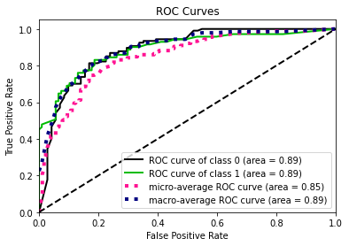


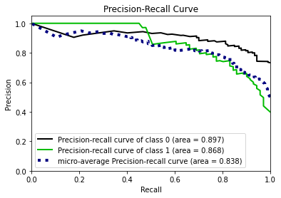


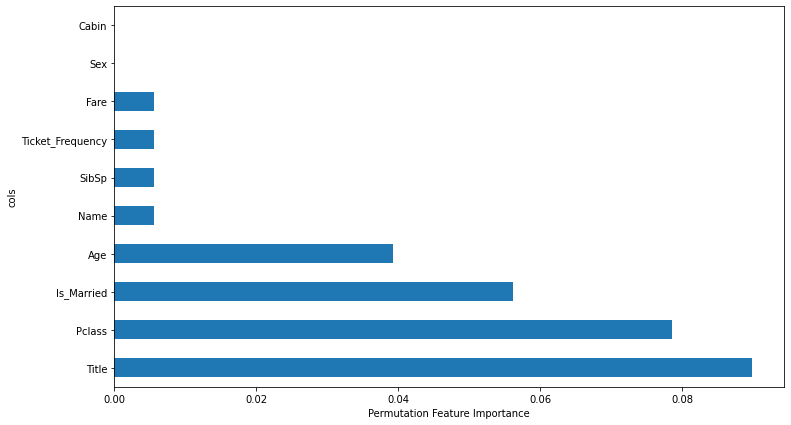


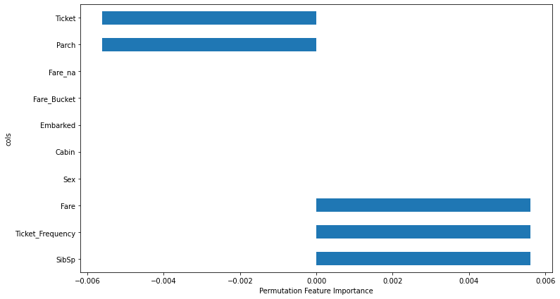


```python

dl_test = tab_train.dnew(df_test)
dl_test.process()

X_test = dl_test.xs

probs = model.predict_proba(X_test)
preds = model.predict(X_test)

sub = pd.DataFrame(df_test.PassengerId.values, columns={'PassengerId'})
sub['Survived'] = np.where(probs[:, 1] > 0.5, 1, 0)

sub.to_csv('titantic_sub.csv', index=False)
```

```python

! kaggle competitions submit  -c titanic -f 'titantic_sub.csv' -m 'Quick Xgboost'
```

    100%|██████████████████████████████████████| 2.77k/2.77k [00:01<00:00, 2.01kB/s]
    Successfully submitted to Titanic - Machine Learning from Disaster

```python

file_list = ['test.csv', 'train.csv', 'titantic_sub.csv', 'titanic.zip', 'gender_submission.csv']
for f in file_list:
    if os.path.exists(f):
        os.unlink(f)
```

## Tabular Playground Series - Oct 2021

```python

! kaggle competitions list -s 'Tabular Playground Series - Oct 2021'
```

    ref                                 deadline             category      reward  teamCount  userHasEntered  
    ----------------------------------  -------------------  ----------  --------  ---------  --------------  
    tabular-playground-series-oct-2021  2021-10-31 23:59:00  Playground      Swag       1089            True  
    hhp                                 2013-04-04 07:00:00  Featured    $500,000       1350           False  


```python

! kaggle competitions submissions  -c tabular-playground-series-oct-2021
```

    fileName        date                 description                                status    publicScore  privateScore  
    --------------  -------------------  -----------------------------------------  --------  -----------  ------------  
    playground.csv  2022-02-03 22:49:05  All Columns ROC Metric Follow Data Fastai  complete  0.76327      0.76355       
    playground.csv  2022-02-03 22:32:49  More Data Fastai                           complete  0.76415      0.76402       
    playground.csv  2022-02-03 22:13:39  Very Little Data Fastai                    complete  0.66276      0.66236       


```python

!kaggle competitions download -c tabular-playground-series-oct-2021
```

    Downloading tabular-playground-series-oct-2021.zip to /home/azureuser/gitlab/sdsde/nbs
    100%|█████████████████████████████████████▉| 1.28G/1.29G [00:26<00:00, 63.4MB/s]
    100%|██████████████████████████████████████| 1.29G/1.29G [00:26<00:00, 52.5MB/s]


```python

! unzip tabular-playground-series-oct-2021.zip
```

    Archive:  tabular-playground-series-oct-2021.zip
      inflating: sample_submission.csv   
      inflating: test.csv                
      inflating: train.csv               


lets try a little bigger problem and see how we do on this type of method

```python

df = pd.read_csv('train.csv')
logger.info(f'Size of data set: {df.shape}')
display(df.head(3))
```

    INFO:__main__:Size of data set: (1000000, 287)


<div>
<style scoped>
    .dataframe tbody tr th:only-of-type {
        vertical-align: middle;
    }

    .dataframe tbody tr th {
        vertical-align: top;
    }

    .dataframe thead th {
        text-align: right;
    }
</style>
<table border="1" class="dataframe">
  <thead>
    <tr style="text-align: right;">
      <th></th>
      <th>id</th>
      <th>f0</th>
      <th>f1</th>
      <th>f2</th>
      <th>f3</th>
      <th>f4</th>
      <th>f5</th>
      <th>f6</th>
      <th>f7</th>
      <th>f8</th>
      <th>...</th>
      <th>f276</th>
      <th>f277</th>
      <th>f278</th>
      <th>f279</th>
      <th>f280</th>
      <th>f281</th>
      <th>f282</th>
      <th>f283</th>
      <th>f284</th>
      <th>target</th>
    </tr>
  </thead>
  <tbody>
    <tr>
      <th>0</th>
      <td>0</td>
      <td>0.205979</td>
      <td>0.410993</td>
      <td>0.176775</td>
      <td>0.223581</td>
      <td>0.423543</td>
      <td>0.476140</td>
      <td>0.413590</td>
      <td>0.612021</td>
      <td>0.534873</td>
      <td>...</td>
      <td>0</td>
      <td>1</td>
      <td>0</td>
      <td>0</td>
      <td>0</td>
      <td>0</td>
      <td>0</td>
      <td>0</td>
      <td>0</td>
      <td>1</td>
    </tr>
    <tr>
      <th>1</th>
      <td>1</td>
      <td>0.181004</td>
      <td>0.473119</td>
      <td>0.011734</td>
      <td>0.213657</td>
      <td>0.619678</td>
      <td>0.441593</td>
      <td>0.230407</td>
      <td>0.686013</td>
      <td>0.281971</td>
      <td>...</td>
      <td>0</td>
      <td>1</td>
      <td>0</td>
      <td>0</td>
      <td>0</td>
      <td>0</td>
      <td>0</td>
      <td>0</td>
      <td>0</td>
      <td>1</td>
    </tr>
    <tr>
      <th>2</th>
      <td>2</td>
      <td>0.182583</td>
      <td>0.307431</td>
      <td>0.325950</td>
      <td>0.207116</td>
      <td>0.605699</td>
      <td>0.309695</td>
      <td>0.493337</td>
      <td>0.751107</td>
      <td>0.536272</td>
      <td>...</td>
      <td>0</td>
      <td>0</td>
      <td>0</td>
      <td>1</td>
      <td>1</td>
      <td>0</td>
      <td>0</td>
      <td>0</td>
      <td>0</td>
      <td>1</td>
    </tr>
  </tbody>
</table>
<p>3 rows × 287 columns</p>
</div>


```python

unique_values = df.iloc[:1000].nunique()
cat_vars = [col for col in  unique_values.index[unique_values < 10] if col!='target']
cont_vars = [col for col in df.columns if col not in cat_vars and col !='id' and col !='target']
y_var = ['target']
```

```python

dl_train, tab_train = generate_fastai_pytorch_dataloader(df, cat_vars=cat_vars, cont_vars=cont_vars, 
                                                         y_var=y_var, y_block=CategoryBlock(), y_range=None,
                                                         val_pct=0.2, bs=1025, procs = [Categorify, FillMissing, Normalize],
                                                         seed=123, splits=None)
```

    INFO:sdsde.modeling.preprocessingfastai:Training Data Size 800000
    INFO:sdsde.modeling.preprocessingfastai:Validation Data Size 200000
    INFO:sdsde.modeling.preprocessingfastai:Categorical Variable(s) For Project ['f22', 'f43', 'f242', 'f243', 'f244', 'f245', 'f246', 'f247', 'f248', 'f249', 'f250', 'f251', 'f252', 'f253', 'f254', 'f255', 'f256', 'f257', 'f258', 'f259', 'f260', 'f261', 'f262', 'f263', 'f264', 'f265', 'f266', 'f267', 'f268', 'f269', 'f270', 'f271', 'f272', 'f273', 'f274', 'f275', 'f276', 'f277', 'f278', 'f279', 'f280', 'f281', 'f282', 'f283', 'f284']
    INFO:sdsde.modeling.preprocessingfastai:Continuous Variable(s) For Project ['f0', 'f1', 'f2', 'f3', 'f4', 'f5', 'f6', 'f7', 'f8', 'f9', 'f10', 'f11', 'f12', 'f13', 'f14', 'f15', 'f16', 'f17', 'f18', 'f19', 'f20', 'f21', 'f23', 'f24', 'f25', 'f26', 'f27', 'f28', 'f29', 'f30', 'f31', 'f32', 'f33', 'f34', 'f35', 'f36', 'f37', 'f38', 'f39', 'f40', 'f41', 'f42', 'f44', 'f45', 'f46', 'f47', 'f48', 'f49', 'f50', 'f51', 'f52', 'f53', 'f54', 'f55', 'f56', 'f57', 'f58', 'f59', 'f60', 'f61', 'f62', 'f63', 'f64', 'f65', 'f66', 'f67', 'f68', 'f69', 'f70', 'f71', 'f72', 'f73', 'f74', 'f75', 'f76', 'f77', 'f78', 'f79', 'f80', 'f81', 'f82', 'f83', 'f84', 'f85', 'f86', 'f87', 'f88', 'f89', 'f90', 'f91', 'f92', 'f93', 'f94', 'f95', 'f96', 'f97', 'f98', 'f99', 'f100', 'f101', 'f102', 'f103', 'f104', 'f105', 'f106', 'f107', 'f108', 'f109', 'f110', 'f111', 'f112', 'f113', 'f114', 'f115', 'f116', 'f117', 'f118', 'f119', 'f120', 'f121', 'f122', 'f123', 'f124', 'f125', 'f126', 'f127', 'f128', 'f129', 'f130', 'f131', 'f132', 'f133', 'f134', 'f135', 'f136', 'f137', 'f138', 'f139', 'f140', 'f141', 'f142', 'f143', 'f144', 'f145', 'f146', 'f147', 'f148', 'f149', 'f150', 'f151', 'f152', 'f153', 'f154', 'f155', 'f156', 'f157', 'f158', 'f159', 'f160', 'f161', 'f162', 'f163', 'f164', 'f165', 'f166', 'f167', 'f168', 'f169', 'f170', 'f171', 'f172', 'f173', 'f174', 'f175', 'f176', 'f177', 'f178', 'f179', 'f180', 'f181', 'f182', 'f183', 'f184', 'f185', 'f186', 'f187', 'f188', 'f189', 'f190', 'f191', 'f192', 'f193', 'f194', 'f195', 'f196', 'f197', 'f198', 'f199', 'f200', 'f201', 'f202', 'f203', 'f204', 'f205', 'f206', 'f207', 'f208', 'f209', 'f210', 'f211', 'f212', 'f213', 'f214', 'f215', 'f216', 'f217', 'f218', 'f219', 'f220', 'f221', 'f222', 'f223', 'f224', 'f225', 'f226', 'f227', 'f228', 'f229', 'f230', 'f231', 'f232', 'f233', 'f234', 'f235', 'f236', 'f237', 'f238', 'f239', 'f240', 'f241']
    INFO:sdsde.modeling.preprocessingfastai:Dependent Variable(s) For Project ['target']
    INFO:sdsde.modeling.preprocessingfastai:dataloader being created
    INFO:sdsde.modeling.preprocessingfastai:   f22  f43  f242  f243  f244  f245  f246  f247  f248  f249  ...      f232  \
    0    2    1     2     1     2     2     2     1     1     1  ... -0.201274   
    2    1    1     1     1     2     2     2     2     1     1  ... -0.197703   
    3    2    1     2     1     2     2     2     2     1     2  ... -0.184619   
    4    1    1     1     1     2     2     1     1     1     2  ... -0.230153   
    5    2    2     1     1     2     2     1     1     2     1  ... -0.167409   
    
           f233      f234      f235      f236      f237      f238      f239  \
    0 -0.110012 -0.708209 -0.474115 -0.421335 -0.178389  0.297206 -0.188262   
    2 -0.087726  0.288215  1.297292 -0.328553 -0.159835 -0.803930 -0.210085   
    3 -0.089444 -0.756796  0.066297  0.774952 -0.247805 -0.794015 -0.215119   
    4 -0.051433  0.583393 -0.048253 -0.912552 -0.253044 -0.033758 -0.212978   
    5 -0.153933 -0.317144 -0.930409 -0.858949 -0.234962  1.301304 -0.242902   
    
           f240      f241  
    0  1.398902 -0.758302  
    2  0.143103  0.244478  
    3 -0.265659 -0.070069  
    4 -0.752056 -0.050181  
    5 -0.796531 -1.181962  
    
    [5 rows x 285 columns]


```python


learn, probs, y, loss = train_fastai_tabular_model(dl = dl_train, 
                                                   layer_sizes = [150, 10],
                                                   metrics = [Recall(), accuracy, F1Score(), RocAucBinary(), BalancedAccuracy()],
                                                   epochs = 3,
                                                   wd=0.2,
                                                   model_name = 'sdsde_test_dl_model_fast.pkl',
                                                   save_metric_monitor = 'balanced_accuracy_score',
                                                   save_comp = np.greater,
                                                   early_metric_monitor = 'balanced_accuracy_score',
                                                   early_comp = np.greater,
                                                   early_min_delta = 1e-5,
                                                   patience = 3,
                                                   tab_config={'embed_p':0.3},
                                                   project_location='projects/model-runs/latest/classification/models/dl/',
                                                   y_range = None, # for regression
                                                   plot=True)
```


    INFO:sdsde.modeling.trainingfastai:Learning Rate Suggestion SuggestedLRs(valley=0.002511886414140463)


<table border="1" class="dataframe">
  <thead>
    <tr style="text-align: left;">
      <th>epoch</th>
      <th>train_loss</th>
      <th>valid_loss</th>
      <th>recall_score</th>
      <th>accuracy</th>
      <th>f1_score</th>
      <th>roc_auc_score</th>
      <th>balanced_accuracy_score</th>
      <th>time</th>
    </tr>
  </thead>
  <tbody>
    <tr>
      <td>0</td>
      <td>0.497218</td>
      <td>0.486757</td>
      <td>0.721554</td>
      <td>0.761705</td>
      <td>0.751746</td>
      <td>0.842479</td>
      <td>0.761707</td>
      <td>01:28</td>
    </tr>
    <tr>
      <td>1</td>
      <td>0.483159</td>
      <td>0.478663</td>
      <td>0.717064</td>
      <td>0.764260</td>
      <td>0.752592</td>
      <td>0.847402</td>
      <td>0.764262</td>
      <td>01:28</td>
    </tr>
    <tr>
      <td>2</td>
      <td>0.477804</td>
      <td>0.476338</td>
      <td>0.724074</td>
      <td>0.764585</td>
      <td>0.754655</td>
      <td>0.848321</td>
      <td>0.764587</td>
      <td>01:28</td>
    </tr>
  </tbody>
</table>


    Better model found at epoch 0 with balanced_accuracy_score value: 0.7617070076542676.


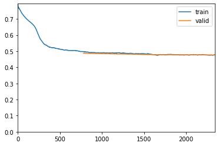


    Better model found at epoch 1 with balanced_accuracy_score value: 0.7642623599106559.
    Better model found at epoch 2 with balanced_accuracy_score value: 0.7645870256614675.


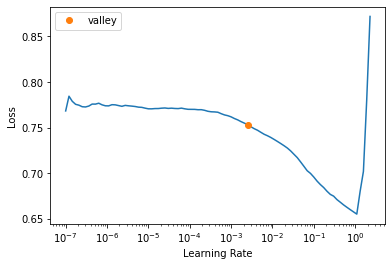


```python


# Uncomment line below to review model arch if you are interested in seeing what a NN arch looks like
# learn.summary()

binary_classification_reporter_fastai_dl(probs, y=y, threshold=0.5, plot=True, bins=5)
```

    INFO:root:Percent Predicted Set 0.46%
    INFO:root:Percent Predicted Set at 0.5 threshold 0.46%


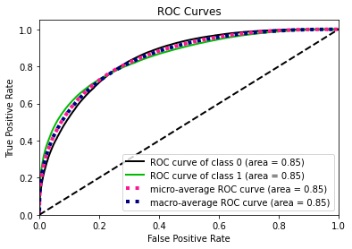


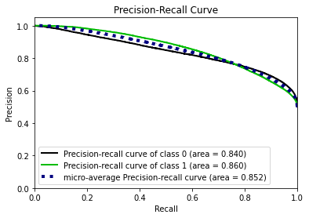


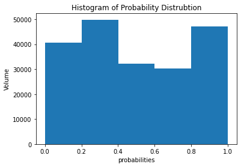


    INFO:root:Percent Return Actual Set 0.5%
    INFO:root:Accuracy For Each Class
    INFO:root:[0.80510026 0.7240738 ]
    INFO:root:[[80506 19489]
     [27594 72411]]
    INFO:root:              precision    recall  f1-score   support
    
               0       0.74      0.81      0.77     99995
               1       0.79      0.72      0.75    100005
    
        accuracy                           0.76    200000
       macro avg       0.77      0.76      0.76    200000
    weighted avg       0.77      0.76      0.76    200000
    
    INFO:root:Accuracy For Each Class 0.4 Cut Off for Model
    INFO:root:[0.80510026 0.7240738 ]
    INFO:root:[[80506 19489]
     [27594 72411]]
    INFO:root:              precision    recall  f1-score   support
    
               0       0.74      0.81      0.77     99995
               1       0.79      0.72      0.75    100005
    
        accuracy                           0.76    200000
       macro avg       0.77      0.76      0.76    200000
    weighted avg       0.77      0.76      0.76    200000
    
    INFO:root:AUC 0.8483214033708035


    (0.8483214033708035, 0.7645870256614675)


```python


test = pd.read_csv('test.csv')
logger.info(f'Size of data set: {df.shape}')
```

    INFO:__main__:Size of data set: (1000000, 287)


```python


infernece_test = test[cat_vars + cont_vars]
test_dl = learn.dls.test_dl(infernece_test.reset_index(drop=True), with_label=False)
probs, _ = learn.get_preds(dl=test_dl)
```


```python


vsub = pd.DataFrame(test.id, columns={'id'})

sub['target'] = np.where(probs[:, 1] > 0.5, 1, 0)

sub.to_csv('playground.csv', index=False)
```

```python


! kaggle competitions submit  -c tabular-playground-series-oct-2021 -f 'playground.csv' -m 'All Columns ROC Metric Follow Data Fastai'
```

    100%|██████████████████████████████████████| 4.77M/4.77M [00:00<00:00, 5.80MB/s]
    Successfully submitted to Tabular Playground Series - Oct 2021

```python


! kaggle competitions submissions  -c tabular-playground-series-oct-2021
```

    fileName        date                 description                                status    publicScore  privateScore  
    --------------  -------------------  -----------------------------------------  --------  -----------  ------------  
    playground.csv  2022-02-03 22:49:05  All Columns ROC Metric Follow Data Fastai  complete  0.76327      0.76355       
    playground.csv  2022-02-03 22:32:49  More Data Fastai                           complete  0.76415      0.76402       
    playground.csv  2022-02-03 22:13:39  Very Little Data Fastai                    complete  0.66276      0.66236       


```python


for f in file_list:
    if os.path.exists(f):
        os.unlink(f)
```

# Other Awesome Tools And Many More In Notebooks

or more examples of the functions go into nbs folder each of the notebooks will have more examples of use case scenarios

# Azure

```python
from sdsde.azure.filehandling import *


fh = FileHandling(os.environ['connection_str'])
fh.download(blob_location = 'noshow_paid.csv.gz',
            dest = 'testing',
            container_name='testing',
            blob_path = '',
            directory = None,
            recursive = True,
            overwrite = True)


show_doc(FileHandling)

unlink_files(['noshow_paid.csv.gz'], './testing')
```

## Upload File(s)/Directories to Azure Blob

```python

show_doc(FileHandling.upload)

fh.upload(container_name='sdsdetest10',
          file_path='testing/')

fh.ls_blob(container_name='sdsdetest10', path='', recursive=True)

fh.rm_container(container_name='sdsdetest10')
```

## Download From Azure Blob
```python
show_doc(FileHandling.download)

assert os.path.exists('testing/noshow_paid.csv.gz') == False, 'File should not be there'
fh.download(blob_location = 'noshow_paid.csv.gz',
            dest = 'testing',
            container_name='testing',
            blob_path = '',
            directory = None,
            recursive = True,
            overwrite = True)
assert os.path.exists('testing/noshow_paid.csv.gz') == True, 'File should be located here'

unlink_files(['noshow_paid.csv.gz'], './testing')
```

## Utils for Azure Blob

```python
show_doc(FileHandling.ls_blob)

fh.ls_blob(container_name='wunderman', path='', recursive=True)

show_doc(FileHandling.ls_containers)

fh.ls_containers(name_starts_with='sdsde')

show_doc(FileHandling.rm_container)
show_doc(FileHandling.create_blob_container)

```
# Snowflake

```python
from sdsde.snowflake.query import *

show_doc(SnowflakeConnect)

sf = SnowflakeConnect(sfAccount=os.environ['sfAccount'],
                   sfUser=os.environ['sfUser'],
                   sfPswd=os.environ['sfPswd'],
                   sfWarehouse=os.environ['sfWarehouse'],
                   sfDatabase=os.environ['sfDatabase'],
                   sfSchema=os.environ['sfSchema'],
                   sfRole=os.environ['sfRole'])

show_doc(SnowflakeConnect.execute_file)

```

## Pandas to Snowflake

```python

show_doc(SnowflakeConnect.infer_to_snowflake)

sf.pandas_to_snowflake(df=df,
                        user=os.environ['sfUser'],
                        password=os.environ['sfPswd'],
                        account=os.environ['sfAccount'],
                        warehouse=os.environ['sfWarehouse'],
                        database=os.environ['sfDatabase'],
                        schema=os.environ['sfSchema'],
                        table_name='sdsdesnowflaketest',
                        chunk_size = None,
                        create_table= True,
                        create_statement= yaml.get('create_test_table'))

sf.run_str_query("SELECT * FROM sdsdesnowflaketest")

show_doc(SnowflakeConnect.infer_to_snowflake)

sf.infer_to_snowflake(df,
                      table_name='sdsdesnowflaketest',
                      if_exists='append')
sf.run_str_query("SELECT * FROM sdsdesnowflaketest")

```
## SQL Execution

```python

df = sf.execute_file(sql='SELECT * FROM ConnectPOC_DEV.PUBLIC.sdsde_test', query_path='testing/view_test.txt')

show_doc(SnowflakeConnect.execute_file_query)

df = sf.execute_file_query('testing/view_test.txt')

show_doc(SnowflakeConnect.run_str_query)

df = sf.run_str_query("SELECT * \
                       FROM ConnectPOC_DEV.PUBLIC.DIMCUSTOMER \
                       LIMIT 10;")
```

# Utils

```python
from sdsde.utils.dataframes import *

show_doc(join_df)

join = join_df(df, df2, left_on=['ecid'])
join.head()

join = join_df(df, df3, left_on=['ecid', 'state'], how='inner')
join.head()
```
